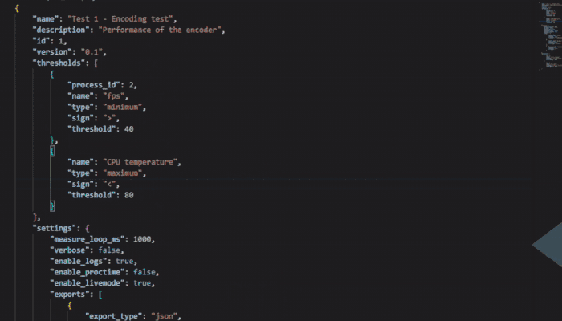
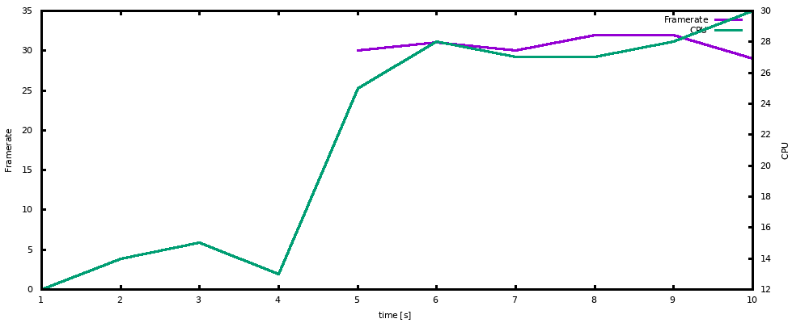
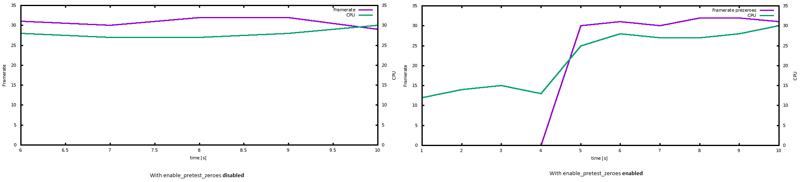

# System Performance Analyser (SPA)

The SPA tool tests the performance for Linux based systems. This tool contains resource usage measurements and analysis to find bottlenecks in a system. These systems can relate to anything, but the SPA tool's main focus is on data pipelines such as video streaming pipelines. Additionally, thresholds can be configured to test whether a system is sufficient based on the system's requirements. These thresholds can be based on actual requirements of a project.

This tool can execute any Linux application as well as [GStreamer](https://gstreamer.freedesktop.org/) pipelines. For GStreamer pipelines, additional data is measured and extra thresholds can be configured.  

## Requirements
To build the tool, the following tools are necessary:
- CMake 
- libstreamer1.0-dev 

Some other necessary libraries are automatically downloaded by running the CMake command in [Installation and usage](#Installation). The libraries that are automatically downloaded are: [nlohmann/json](https://github.com/nlohmann/json) and [FTXUI](https://github.com/ArthurSonzogni/FTXUI).  

## Installation and usage
To create the executable, the following steps have to be executed:

1. Clone the Git repository: `git clone <repo link>`
2. Create a build folder and enter it (`mkdir build && cd build`)
3. Execute the CMake build script: `cmake ..` (this downloads necessary packages automatically)
4. Build the sources with: `make` 
5. If no errors occur, the executable `spa` has been built! :)

### Usage
To execute the tool, two configuration files are necessary. One is the configuration of the metrics that are measured, the other contains the configuration of the test. Examples of these files can be found in `example_configs/`. The sensor configuration `example_configs/sensor_configs/linux_config.json` can be used on most systems for a default metrics configuration. The `example_configs/test_configs/minimal.json` can be used as a simple test. 

To execute a test with these files, execute the following steps:

1. Enter the build folder: `cd build`
2. If the sources are not build yet, execute the [Installation steps](#Installation)
3. Execute the test: `./spa -c ../example_configs/minimal.json -s ../example_configs/minimal_linux.json` 

In [Section Configuration](#configuration), the test and metrics files are described how they can be configured for custom systems. 

## Tests
To build and execute the tests, execute the following steps:

1. Go to the build folder created in the [Installation](#Installation) process
2. Re-execute the CMake command with the parameter `BUILD_TESTS` as follows: `cmake -D BUILD_TESTS=ON ..`
3. Rebuild the `spa` application including the tests with: `make` (exactly the same as step 4 of the [Installation](#Installation)) process
4. Execute the tests by executing: `./tests/tests`, this will run all tests
5. The tests should all pass

## Tool's Output

The tool supports multiple output methods, being: `JSON`, `CSV`, `a summary in the terminal`, or `Graphs generated with Gnuplot`. 

| **Output method** | **Description** | **Config name, see [Export settings](#export-settings)** |
| --- | --- | --- | 
| JSON | An exported JSON file with summarized data of all metrics (median, mean, min, and max) and with all calculated correlations  | json |
| CSV | Exported CSV files for the system resources, [GStreamer](https://gstreamer.freedesktop.org/) measurements, and measurements on processes. Contains all measurements for the metrics | csv |
| Terminal summary | A summary shown in the terminal that executes the SPA tool (or shown in `stdout`). This output can be more/less verbose by configuring the test file | terminal |
| Graphs | Automatically creates graphs of all the strongly correlated metrics (performance metrics correlated with system resources). This can be used to easily visualize the correlations, but can take the most time to generate the graphs | graphs | 

## Configuration

The configuration of the SPA tool is handled using two different JSON configuration files. One is the [config file](#config-file), which contains the configuration for the to-be-executed test. The other one is the [metrics file](#metrics-file), which contains all the metrics that need to be measured.

### Config file

JSON Field | Field type | Description | Optional
--- | --- | --- | ---
processes | Array[[JSON Object]](#processes-configuration) |  Configuration for the processes that need to be executed for the test, see [Processes configuration](#processes-configuration) for configuring processes | false
settings  | Array[[JSON Object]](#settings)| General settings for the test, see [Settings](#settings) for all supported settings | false
threshold | Array[[JSON Object]](#threshold-configuration) | Contains the thresholds for the test, see [Threshold configuration](#threshold-configuration) for configuring thresholds | false

#### Processes configuration

The processes that need to be executed can be configured in the `processes` field at the top level of the JSON. These processes are executed by the tool and monitored for their performance.

JSON Field | Field type | Description | Optional 
--- | --- | --- | ---
id | Integer | Custom ID for the process, identifier for the process in the exports | false
type | String | The type of application which will be executed. This field is strictly defined and can only be:   `linux_command`: Execution of Linux applications    `gstreamer`: Execution of a GStreamer pipeline (supports any GStreamer pipeline without quotes) | false
command | String | The application / GStreamer pipeline that will be executed | false
start_delay | Integer | The delay at which the process needs to be started in milliseconds | true
use_steady_state | Boolean | Enable/disable the removal of measurements at the beginning and end of a pipeline. This can be used to get more accurate lowest, highest, and average values | true

#### Settings

The table below contains the supported settings for the SPA tool.

JSON Field | Field type | Description | Optional
--- | --- | --- | ---
measure_loop_ms | Integer | Configures the frequency of measuring the configured metrics in milliseconds | false
enable_proctime | Boolean | Shows the processing time for each component in a GStreamer pipeline | true
exports | Array[[JSON Object](#export-settings)] | Configures the exports to execute and the settings of that export type, see [Export settings](#export-settings) for configuring the exports | true
enable_livemode | Boolean | Enables live output during the test. For certain measurements, the live data is shown in the terminal  | true
enable_pretest_zeroes | Boolean | By default "false", but this can give better/worse results for finding correlations between measured sensors. For an explanation of this field, see [Pretest zeroes](#pretest-zeroes) | true

##### Pretest zeroes
For process specific metrics (such as the framerate), the measured values are only stored when the process is active. But for finding correlations between the framerate and a system resource such as the CPU usage, the impact of starting the process can be relevant. To be able to get the correlations on startup, adding zeroes if a test has not been started can be useful for better correlation detection.

To explain it better, the difference for the correlation comparison is shown. The figure below shows the measurements data in a graph. This is the raw measurements data, and it can be seen that the framerate starts at the 5th second. Before the 5th second, no framerate was measured.  

The image below shows the input data for the correlation analysis with pretest-zeroes enabled or disabled. With the pretest-zeroes disabled, the seconds where no framerate was measured are removed and the analysis is only executed on the existing framerate measurements. When the pretest-zeroes is enabled, zeroes are added to the framerate when there is no framerate measured yet. This can improve the correlation method as the increase between the 4th second and 5th second is now included in the correlation analysis.  

##### Export settings
To configure the exports, the structure in the table below can be used. When there are no exports configured, no exports are executed.

JSON Field | Field type | Description | Optional
--- | --- | --- | ---
export_type | String | The type of export this configuration is for, can be: `json`, `graphs`, `terminal`, and `csv`. See [Output](#output) for the meaning of these export methods | false
enabled | Boolean | Enable/disable the export | false
filename | String | Used for the `json` export, to configure the name of the JSON file | true
foldername | String | Only used for the `graphs` export type, to configure the output location of all generated graphs | true

#### Threshold configuration
The supported values for the threshold configuration can be found in the table below.

JSON Field | Field type | Description | Optional
--- | --- | --- | ---
process_id | Integer | The process ID this threshold relates to, should be equal to the process ID configured in [Processes configuration](#processes-configuration) | true
name | String | The name of the metric to which the threshold relates, should be equal to the name configured in the [Metrics file](#metrics-file). For the `fps` and `processing time`, collective names to get the collection of all components are created (as each component in a GStreamer pipeline is separately measured), these collective names are `fps` and `processing time` | false
type | String | The type of measurement value to use, these types are strictly defined and can be: `minimum`, `maximum`, `median`, and `average` | true
sign | String | The sign that is used for the threshold comparison, the formula `<measured value> <sign> <threshold> ` is used, supported signs: "`>`", "`<`", "`>=`", "`<=`" | true
threshold | Numeric | The threshold for which the process/system resource is checked | false 

### Metrics file

The top level of the metrics file only has one parameter

JSON Field | Field type | Description | Optional
--- | --- | --- | ---
sensors | Array[[JSON Object](#sensors)] | An array containing all metrics that will be measured | false

#### Sensors
All metrics are configured with the variables described in the table below. 

JSON Field | Field type | Description | Optional
--- | --- | --- | ---
name | String | Name of the metric/sensor | false
<!-- class | Integer | | true -->
type | String | Type of the field, this is strictly defined and can be:   `DIRECT`: Retrieve a value directly from a file   `PROC`: Retrieve a value from `/proc/stat`   `PROCMEM`: Retrieve a value from `/proc/statm`   `PIDSTAT`: Retrieve a value from `/proc/<pid>/stat`   `PIDSTATM`: Retrieve a value from `/proc/<PID>/statm`   `DIRECT_PID`: Retrieve a value directly from a file which is for one specific PID | true`
compared_to | String | For `/proc/stat`, `/proc/statm`, `/proc/<PID>/stat`, and `/proc/<PID>/statm` to compare different values with each other. | false
value | String | The name of the wanted value, this can be divided by another value with `compared_to`. The name of the wanted values can be found in the man pages of `/proc/stat`, `/proc/statm`, `/proc/<PID>/stat`, and `/proc/<PID>/statm`. This field is required for `PROC`, `PROCMEM`, `PIDSTAT`, and `PIDSTATM` | depends on the type
path | String | The path that needs to be read for the value, required for types requiring the PID, and `DIRECT`, for paths requiring a PID, the PID number must be replaced by `$PID$`, so for stat: `/proc/$PID$/stat` | false
multiplier | Numeric | Configure a custom multiplier to get the wanted unit, to go from MHz to GHz, multiply by 0.001 | false 
suffix | String | Configure a custom suffix/unit for the value, used for the output to make it more readable | false 
minimum | Numeric | Configure a minimum for the value | false
maximum | Numeric | Configure a maximum for the value | false

Note: For the `compared_to` and `value` field for `/proc/stat`, special values are defined to group the CPU values for a core. The name `all` refers to all values for a CPU combined, the name `all_exept_idle` refers to all values except for the idle value. This allows for metrics that compare one CPU field with all other fields.

For convienience, a type called `ARRAY` is also supported to measure the same path but with a different index. Such as the CPU cores, there can be a lot of cores that need to be monitored. To only implement each core once, instead of 16 times (for 16 core system), the `ARRAY` field is created. The required values are shown below.

JSON Field | Field type | Description | Optional
--- | --- | --- | ---
name | String | The name of the group | false
size | Integer | The number of cores to count to, it will count from 0-size | false
data | Array[[JSON object](#sensors)] | The sensors that will be measured, the `$INDEX$` tag will be replaced by the number of the core | false

## How to contribute
### TLDR
When contributing to this repository, please first discuss the change you wish to make via issue, email, or any other method with the owners of this repository before making a change. Please note we have a code of conduct, please follow it in all your interactions with the project.

### **Did you find a bug?**
* **Ensure the bug was not already reported** by searching on GitHub under
[Issues](https://github.com/ProdriveTechnologies/SPA/issues).
* If you're unable to find an open issue addressing the problem, [open a new one](https://github.com/ProdriveTechnologies/SPA/issues/new/choose).
Be sure to include a **title and clear description**, as much relevant information as possible.
* If possible, use the relevant issue templates to create the issue.
### **Did you write a patch that fixes a bug?**
* Open a new GitHub pull request with the patch.
* Ensure the PR description clearly describes the problem and solution. Include the
relevant issue number if applicable.
### **Did you fix whitespace, format code, or make a purely cosmetic patch?**
Changes that are cosmetic in nature and do not add anything substantial to the stability, functionality, or testability of SPA will generally not be accepted.
### **Do you intend to add a new feature or change an existing one?**
* Suggest your change by opening an issue

### **Do you have questions about the source code or usage?**
* Ask any question about how to use voyager by opening a blank issue.

## License
[Apache License 2.0](https://choosealicense.com/licenses/apache-2.0/)

## Contact
Feel free to open an issue with your questions or ideas. If there's something that cannot be disclosed through an issue, or example, a vulnerability, then send an email to: [opensource@prodrive-technologies.com](mailto:opensource@prodrive-technologies.com).